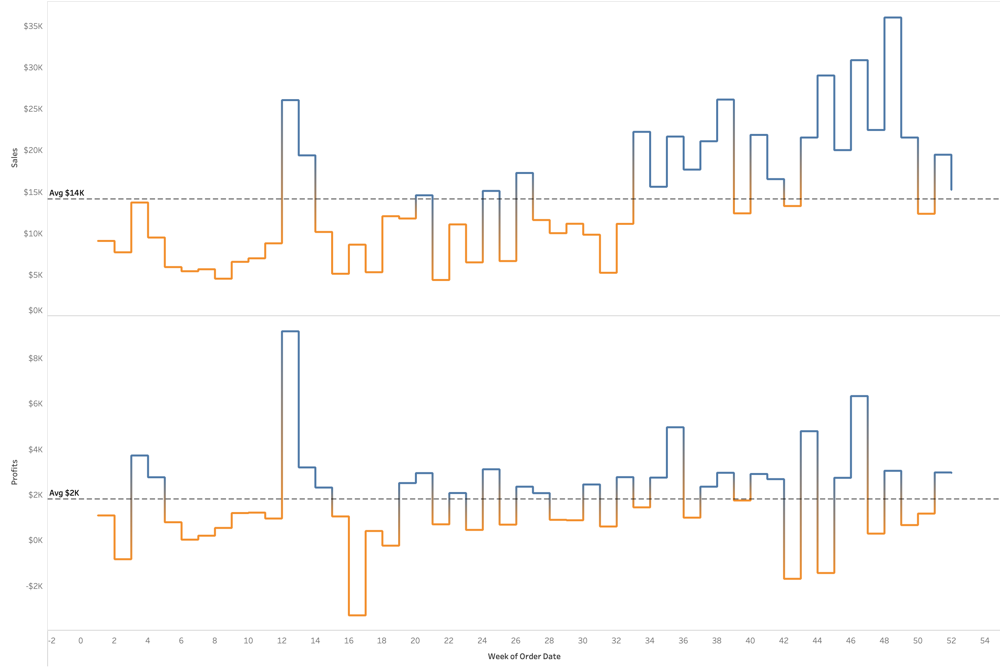

# 📊 Sales Performance Dashboard | 2023

## 🚀 Project Overview
This project focuses on **analyzing sales performance, profit trends, and product category insights** using a **data-driven dashboard**. The dashboard provides **year-over-year comparisons (2023 vs. 2022)** to track key business metrics.

## 🎯 Key Objectives
- **📈 Track Total Sales Growth**: Understand revenue performance across months.
- **💰 Analyze Profit Trends**: Identify profitable and loss-making categories.
- **📦 Evaluate Product Performance**: Compare sales and profitability by subcategories.
- **📊 Identify Seasonal Trends**: Understand fluctuations in sales and profits over time.

## 🔑 Key Insights
- **Total Sales**: **$733K** (📈 +20.36% vs. PY)
- **Total Profits**: **$93K** (📈 +14.24% vs. PY)
- **Total Quantity Sold**: **$12K** (📈 +26.83% vs. PY)
- **Profit/Loss Trends**: Some subcategories like **Machines and Envelopes** recorded losses.
- **Sales Trend**: Growth observed in the **latter half of the year**, peaking in December.

## 🛠️ Tools & Technologies
- **Database**: SQL (MySQL)  
- **Data Visualization**: Tableau
- **Analytics**: Excel  

## 📌 Next Steps
- **Deep dive into loss-making subcategories** to identify improvement opportunities.
- **Identify high-growth periods** for future sales strategies.
- **Enhance data granularity** by segmenting customers and regions.

📢 *This dashboard helps businesses make data-driven decisions to optimize revenue and profitability in 2024!*

# 📊 KPI Dashboard Explanation

This visualization presents three key performance indicators (**KPIs**) for the year:

1. **Total Sales** 📈  
   - **$733K** in total sales.  
   - **Increased by 20.36% compared to the previous year (PY)**.  
   - The black trend line represents **current year sales**, while the gray line represents **previous year sales**.
   - **Key points:**
     - The **orange dot** highlights a **low-performing period** early in the year.
     - The **blue dot** marks a **high-performing period** towards the end of the year.

2. **Total Profits** 💰  
   - **$93K** in total profit.  
   - **Up by 14.24% vs PY**, indicating a positive growth trend.  
   - **Key points:**
     - The **blue dot** shows a peak in profit.
     - The **orange dot** highlights a **decline or loss** period.

3. **Total Quantity Sold** 📦  
   - **12K units sold** throughout the year.  
   - **A strong 26.83% increase from the previous year**.  
   - **Key points:**
     - The **orange dot** represents a **low quantity sales period**.
     - The **blue dot** marks a **high quantity sales peak**.

---

## 🧐 Insights:
- Overall, the company **grew in sales, profits, and quantity sold**, indicating strong performance.
- The **biggest challenge** appears to be **profitability**, which did not grow as fast as sales and quantity.
- **Recommendations:**
  - Investigate periods of **low performance (orange dots)** to understand potential issues.
  - Focus on **profit margin improvements** to ensure profitability grows alongside sales.

📌 **Conclusion:** Strong overall performance, but profitability growth should be optimized.

# 📊 Subcategory Sales and Profit Comparison

This visualization provides a comparative analysis of sales and profit performance across different product subcategories for the current year (CY) and previous year (PY).

## 🔍 Breakdown of the Chart:
- **Left Side (Bar Chart) - Sales Comparison:**
  - **Black Bars** → Current Year (CY) Sales
  - **Grey Bars** → Previous Year (PY) Sales
  - This helps in understanding sales growth or decline compared to last year.

- **Right Side (Bar Chart) - Profit Analysis:**
  - **Blue Bars** → Profit made in the current year.
  - **Orange Bars** → Loss incurred in the current year.
  - The length of the bars represents the magnitude of profit/loss.

## 🧐 Key Insights:
1. **Phones and Chairs** have strong sales growth compared to last year.
2. **Machines and Envelopes** have incurred significant losses (highlighted in orange).
3. **Tables and Copiers** show strong profitability in the current year.
4. **Bookcases and Furnishings** have seen stable sales but varying profits.
5. The visualization helps in identifying underperforming subcategories that may need strategic changes.

This chart is useful for business decisions such as inventory management, discount strategies, and profitability optimization.

# 📊 Weekly Sales and Profit Trend Analysis

This visualization presents a week-by-week trend analysis of **Sales** and **Profits** for the year 2023. It consists of two line charts:  

- **Top Chart: Sales Trend**
- **Bottom Chart: Profit Trend**

---

## 🔍 Breakdown of the Visualization:
- **Color Coding:**
  - **Blue** → Positive Sales/Profits
  - **Orange** → Negative Sales/Profits (Indicating Losses)
  
- **Dashed Lines Represent Averages:**
  - **Sales Average** → $14K
  - **Profit Average** → $2K

- **X-Axis:** Represents the **week number** of the order date.
- **Y-Axis:** Represents the **sales and profit values**.

---

## 🧐 Key Insights:
1. **Sales Growth Over Time:**
   - Sales show an increasing trend towards the latter half of the year.
   - Several weeks exceed the $14K sales average, especially in the second half.

2. **Profit Volatility:**
   - Profit remains inconsistent, with fluctuations above and below the $2K average.
   - Some weeks experience **significant losses** (marked in orange).

3. **Correlation Between Sales and Profit:**
   - Not all high sales weeks result in high profits.
   - Some weeks have strong sales but still result in negative profits, indicating potential issues with pricing, cost, or discounts.

---

## 📌 Business Recommendations:
- Investigate the reasons behind negative profit weeks despite high sales.
- Focus on improving **profit margins** rather than just increasing sales.
- Optimize product pricing and discounting strategies to avoid frequent losses.

# 📊 Sales Performance Dashboard | 2023

# 👥 Customer Dashboard | 2023

## 📌 Project Overview
This project analyzes **customer behavior, sales distribution, and order trends** using a **data-driven dashboard**. The dashboard provides **year-over-year (YoY) comparisons (2023 vs. 2022)** to evaluate business growth and customer profitability.

## 🎯 Key Objectives
- **📊 Monitor Customer Growth**: Track the total number of customers.
- **💰 Analyze Customer Sales & Profitability**: Evaluate sales per customer and top profitable customers.
- **📦 Understand Order Patterns**: Assess order distribution and growth.
- **📈 Identify High-Value Customers**: Recognize top customers by profit contribution.

## 🔑 Key Insights
- **Total Customers**: **693** (📈 +8.62% vs. PY)
- **Total Sales Per Customer**: **$1,058** (📈 +10.80% vs. PY)
- **Total Orders**: **1,687** (📈 +28.29% vs. PY)
- **Customer Order Distribution**:
  - Majority (400 customers) placed **1-2 orders**.
  - Only **12 customers placed 6+ orders**.
- **Top 10 Customers by Profit**:
  - **Raymond Buch** contributed the highest profit (**$6,781**).
  - Other high-profit customers include **Hunter Lopez and Tom Ashbrook**.

## 🛠️ Tools & Technologies
- **Database**: SQL (MySQL)  
- **Data Visualization**: Tableau / Power BI  
- **Analytics**: Excel / Python (Optional)  

## 📌 Next Steps
- **Target repeat customers** with personalized promotions.
- **Identify opportunities** to increase order frequency.
- **Segment customers** based on sales trends for better marketing strategies.

📢 *This dashboard enables businesses to enhance customer relationships and boost revenue in 2024!*

### Chart Analysis: Business Metrics Comparison (2023 vs. 2022)

#### 1. **Total Customers**
- **2023 Total**: 693 customers
- **Increase**: 8.62% from 2022
- **Highlights**:
  - **Highest Month**: Marked with a blue dot
  - **Lowest Month**: Marked with an orange dot

#### 2. **Total Sales Per Customer**
- **2023 Average**: $1,058 per customer
- **Increase**: 10.80% from 2022
- **Highlights**:
  - **Highest Month**: Blue dot
  - **Lowest Month**: Orange dot

#### 3. **Total Orders**
- **2023 Total**: 1,687 orders
- **Increase**: 28.29% from 2022
- **Highlights**:
  - **Highest Month**: Blue dot
  - **Lowest Month**: Orange dot

### Key Insights
- All three metrics showed **positive growth trends** in 2023 compared to 2022.
- Visual emphasis on monthly highs and lows provides opportunities to analyze performance during peak and low periods.

# 📊 Customers Distribution by Number of Orders

## 📌 Chart Overview
This bar chart represents the **distribution of customers** based on the **number of orders placed** in 2023. It helps identify customer ordering patterns and the frequency of repeat purchases.

## 🔍 Key Insights
- **200 customers** placed **only 1 order**, indicating a high number of one-time buyers.
- Another **200 customers** placed **2 orders**, showing a slight increase in repeat purchasing.
- **156 customers** placed **3 orders**, demonstrating a consistent decline in customer retention beyond two orders.
- As the number of orders increases, the number of customers **gradually decreases**:
  - **85 customers** placed **4 orders**.
  - **39 customers** placed **5 orders**.
  - Only **9 customers** placed **6 orders**.
  - A very small group (**2 customers each**) placed **7 or 8 orders**.

## 🏆 Business Implications
- The majority of customers (**~72%**) placed **1 to 3 orders**, highlighting an opportunity to improve **customer retention**.
- A targeted **loyalty program** or **personalized offers** can encourage more repeat purchases.
- Identifying high-value, frequent customers (6+ orders) can help businesses implement **VIP rewards or premium services**.

## 📈 Recommendations
- **Increase Repeat Purchases**: Implement targeted marketing campaigns to move customers from **1-2 orders** to **3+ orders**.
- **Segment Customers**: Identify behaviors of high-order customers and apply similar strategies to lower-order groups.
- **Improve Retention Strategies**: Offer discounts, subscriptions, or bundled deals to encourage continued engagement.

🚀 *This analysis provides a roadmap for customer growth and business expansion in the next financial year!*

# 🏆 Top 10 Customers by Profit

## 📌 Chart Overview
This table displays the **top 10 customers** ranked by **profit contribution** in 2023. It includes details on **maximum order date**, **total profits**, **total sales**, and the **distinct count of orders** placed by each customer.

## 🔍 Key Insights
- **Raymond Buch** is the **top customer**, generating **$6,781 in profits** with **$14,203 in sales** across **3 orders**.
- **Hunter Lopez** follows, with **$5,046 in profits** and **$10,523 in sales**, from **2 orders**.
- **Tom Ashbrook** generated **$4,599 in profits** with **$13,723 in sales**, ranking third.
- The **number of orders varies** among the top customers:
  - **Helen Wasserman** and **Brian Moss** had **5 orders each**, yet their profits are lower than top-ranked customers.
  - **Steven Roelle**, despite being in the top 10, placed only **1 order** but contributed **$1,676 in profits**.

## 🏆 Business Implications
- **Repeat high-value customers** (those with **multiple orders**) can be nurtured with exclusive offers.
- **High-profit single-order customers** (e.g., **Steven Roelle**) may indicate potential for larger one-time purchases—consider targeting them with premium services.
- **Potential Upselling Opportunities**:
  - Customers placing **2-3 orders** could be incentivized to place more orders via **loyalty rewards** or **personalized recommendations**.

## 📈 Recommendations
- **Loyalty Programs**: Reward frequent buyers like **Helen Wasserman** and **Brian Moss** to encourage continued engagement.
- **Targeted Upselling**: Identify and target **high-value but infrequent** customers (e.g., **Steven Roelle**) with specialized deals.
- **Increase Customer Engagement**: Implement strategies like **email campaigns, discounts, or membership perks** to increase order frequency.

🚀 *Optimizing customer retention strategies will drive profitability and sustain revenue growth!*

# 👥 Customer Dashboard | 2023

